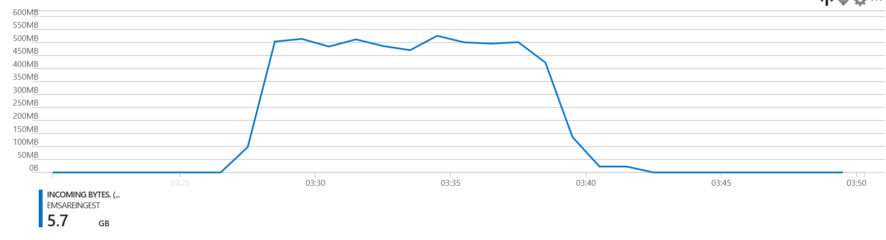
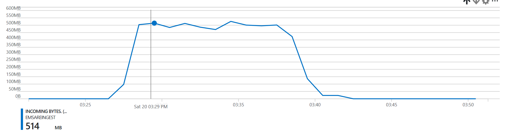
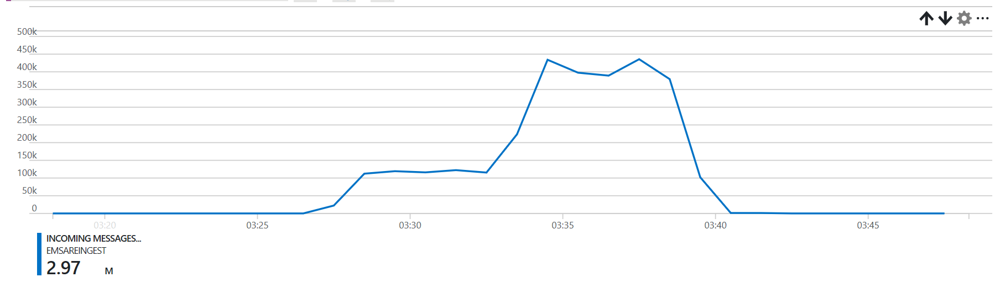
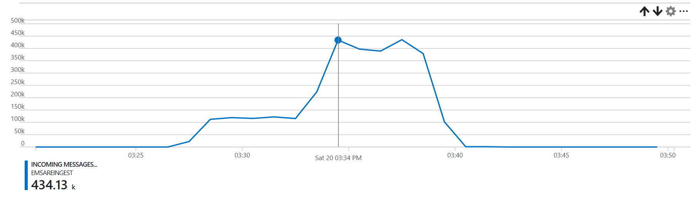
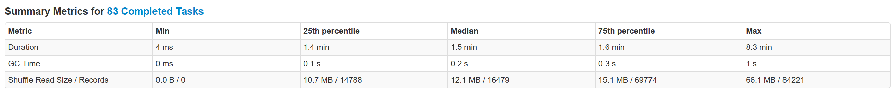
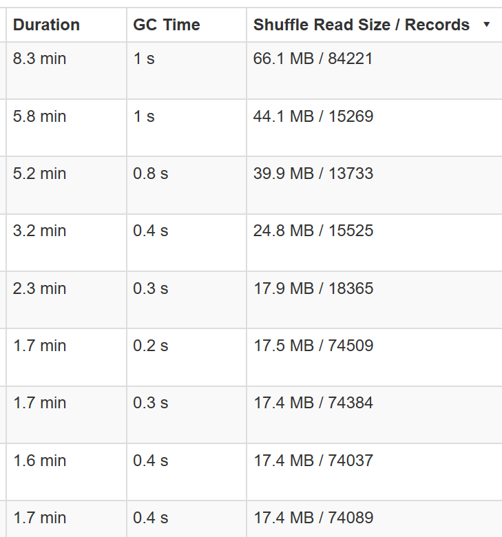

# EventHubs Reingestion (Capture or other sources)

## Inputs

We require a `Dataset` with, following columns:
* a `ts` as `java.sql.Timestamp` column
* a `body` as `Array[Byte]`
* a `eh_partion` as `int`
    * Either randomly using `random_partition()`
    * Or based on a field `column_to_partition()`

### EventHubs Capture data
If you want to ingest everything inside a `EventHubs Capture` target, you can leave the `spark.eventhubsreingest.query` 
empty. It will look for all `inputs` with as `format`: `avro` or `com.databricks.spark.avro`. 

As `path` you can specify the path to `Azure Blob` or `Azure Datalake`, Spark accepts wildcards, although they are 
unnecessary if you use 
`{Namespace}/{EventHub}/year={Year}/month={Month}/day={Day}/hour={Hour}/minute={Minute}/capture-{Second}-{PartitionId}` 
as the `capture file name format` (it's seen as a partitioned table).

The query being used for this is: 
```sql
SELECT
  ehcapture_timestamp(`EnqueuedTimeUtc`) as `ts`,
  `Body` as `body`,
  random_partition() as `eh_partition`
FROM internal_capture_alias
ORDER BY
  year(`ts`), dayofyear(`ts`), hour(`ts`), `eh_partition`
```

Everything else is done automatically.

### Query based inputs 
By specifying `spark.eventhubsreingest.query` you can customize the query used to read the data.
You can read from Hive & Spark SQL tables, if you have a centralized metastore. Additionaly, you can add `temporary views` 
by specifying `spark.eventhubsreingest.inputs.`, each `alias` is queryable. 

For example we want to read EventHubs capture data, but only data for a specific day, we could use following `query`:

```sql
SELECT 
    ehcapture_timestamp(EnqueuedTimeUtc) as `ts`, 
    Body as body,
    random_partition() as `eh_partition` 
    FROM capture WHERE year='2018' AND month='01' AND day='16'
    ORDER BY year(`ts`), dayofyear(`ts`), hour(`ts`), `eh_partition`
```

Do note the `ehcapture_timestamp` function, which translates EventHubs capture Date Time strings into the right format. 
The data itself is using the `capture file name format` from above.

Specifying the query and the rest of the inputs config now looks like this:

```
spark.eventhubsreingest.inputs.capture.path="wasbs://..."
spark.eventhubsreingest.inputs.capture.format=com.databricks.spark.avro

spark.eventhubsreingest.query="SELECT ehcapture_timestamp(EnqueuedTimeUtc) as ts, Body as body, random_partition() as `eh_partition` FROM capture WHERE year='2018' AND month='01' AND day='16' ORDER BY `year`, `month`, `hour`, `eh_partition`"
```

You have access to the full Spark SQL functionality, including joins, etc.

#### Partitioning based on a field within the message.

It's possible to use your own partitioning strategy, by looking at the contents of the message.

Suppose we have json messages, that look like this:

```json
{"id":"arandomid1", "k":"d"}
{"id":"arandomid2", "k":"d"}
{"id":"arandomid1", "k":"d"}
```

We could use following query:

```sql
SELECT
  `ts`,
  `data` as `body`,
  column_to_partition(get_json_object(`data`, '$.id')) as `eh_partition`
FROM `testds_hash`
ORDER BY
  year(`ts`), dayofyear(`ts`), hour(`ts`), `eh_partition`
```

The `column_to_partition` udf will partition the messages based on the `String.hashCode % NUMBER_OF_PARTITIONS`. 


### Caching

By default the input dataset is cached using `.cache`, if you want to disable this, set:
```
spark.eventhubsreingest.cache=false
```

## Output

The output is always a Azure EventHub, you can specify the credentials:
```
spark.eventhubsreingest.output.eh.ns=""
spark.eventhubsreingest.output.eh.name=""
spark.eventhubsreingest.output.eh.keyName=""
spark.eventhubsreingest.output.eh.keyValue=""

# set by default to 260 ms (because 1 throughput unit is 1mb/s and batch size is 256kb, with some margins).
spark.eventhubsreingest.output.eh.ms_to_wait_after_batch="260"
```

The application connects to EventHub to discover the partition layout, and divides the dataset in the exact 
same amount of partitions (random assignment). It sorts the data based on `year`, `dayofmonth`, `hour`, 
`random partition`.

The application will try to batch as many messages as possible, taking into account the [limits
of EventHub](https://docs.microsoft.com/en-us/azure/event-hubs/event-hubs-quotas). Most importantly:
* Max `Event`/`Batch` size of `256kb`
* `Up to 1 MB per second of ingress events`, 
see [EventHubs FaQ](https://docs.microsoft.com/en-us/azure/event-hubs/event-hubs-faq), we accomplish
this by assuming there are as many partitions as throughput units and waiting for `300ms` after we've send 
each batch. Multiple partitions can be send in parallel though. 

## Executing on HDInsight using livy

The `livy.sh` script will upload and submit the jar file. The `livy.sh` script assumes you have build the source code from scratch (`sbt assembly`).

```bash

export STORAGE_ACCOUNT_NAME="YOUR STORAGE ACC"
export STORAGE_CONTAINER_NAME="YOUR STORAGE CONTAINER"

export CLUSTER_URL="https://CLUSTERNAME.azurehdinsight.net"
export CLUSTER_USER="admin"
export CLUSTER_PASSWORD='A PASSWORD'

APP_CONF="\"spark.eventhubsreingest.inputs.capture.path\":\"wasbs://CAPTURE_CONTAINER@CAPTURE_STORAGE_ACC.blob.core.windows.net/PATH_TO_FILES/\""
APP_CONF="$APP_CONF,\"spark.eventhubsreingest.inputs.capture.format\":\"avro\""

APP_CONF="$APP_CONF,\"spark.eventhubsreingest.output.eh.ns\":\"EVENTHUB NAMESPACE\""
APP_CONF="$APP_CONF,\"spark.eventhubsreingest.output.eh.name\":\"EVENTHUB NAME\""
APP_CONF="$APP_CONF,\"spark.eventhubsreingest.output.eh.keyName\":\"RootManageSharedAccessKey\""
APP_CONF="$APP_CONF,\"spark.eventhubsreingest.output.eh.keyValue\":\"EVENTHUB Key"

export APP_CONF="$APP_CONF"

./livy.sh
```

Checking the status can be done through the Yarn UI, or using
`curl -k --user "$CLUSTER_USER:$CLUSTER_PASSWORD" "$CLUSTER_URL/livy/batches"`

## Performance

On a:
* 3 worker node HDI cluster
* a target EventHub
  * 12 partitions
  * 12 throughput units
* 5.6gb of capture files, with some small and some large events:
  * 1,592 blobs
  * 5,616,207,929 bytes
  
We manage to process the data in `15 minutes`. 

#### Throughput in mb




#### Throughput in msg/s



#### Distribution of Spark taks


Do notice that the task time is highly correlated with the input size.

